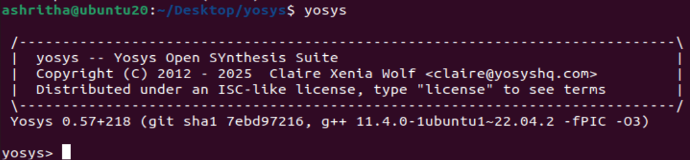
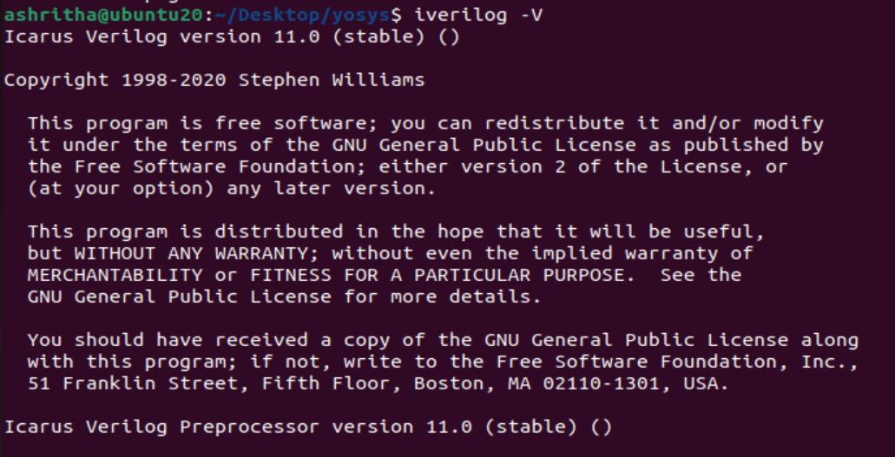
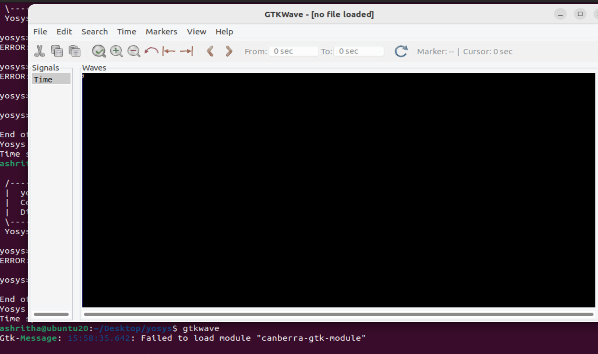

## ✅ Week0 – VLSI System Design (VSD) Program Foundation & Tools Installation Instructions

This repository contains the installation and setup steps for the **VLSI System Design Program** tasks for Week 0.

---

### 1. **Setting up Oracle VirtualBox and Ubuntu**

**Step 1: Install Oracle VirtualBox**

* Download the latest version of **Oracle VirtualBox** from the official website:
  [VirtualBox Downloads](https://www.virtualbox.org/wiki/Downloads).

**Step 2: Install Ubuntu on VirtualBox**

* Download the **Ubuntu 20.04+ ISO** from the official site:
  [Ubuntu Downloads](https://ubuntu.com/download/desktop).
* Launch VirtualBox and click **New** to create a new virtual machine:

  * Name: `Ubuntu20.04`
  * Type: **Linux**, Version: **Ubuntu (64-bit)**
  * Allocate resources:

    * **RAM**: 8 GB
    * **CPU**: 4 vCPUs
    * **Hard Disk**: 50 GB
  * Select **Use an existing virtual hard disk file** and browse to the downloaded **Ubuntu ISO**.
* Start the virtual machine and follow the on-screen instructions to install Ubuntu.

**Step 3: System Requirements for VirtualBox**

Before proceeding, ensure your system has the following specs:

* **RAM**: 6 GB or higher
* **Hard Disk**: 50 GB or higher
* **Operating System**: Ubuntu 20.04 or higher
* **CPU**: 4 vCPUs

---

### 2. **Tool Installation Instructions**

**1. Yosys (Verilog Synthesis Tool)**

```bash
sudo apt-get update
git clone https://github.com/YosysHQ/yosys.git
cd yosys
sudo apt install make
sudo apt-get install build-essential clang bison flex \
libreadline-dev gawk tcl-dev libffi-dev git \
graphviz xdot pkg-config python3 libboost-system-dev \
libboost-python-dev libboost-filesystem-dev zlib1g-dev
make config-gcc
make
sudo make install
yosys
```

  
*Figure 1: Yosys installation*

**2. Iverilog (Verilog Compiler)**

```bash
sudo apt-get update
sudo apt-get install iverilog
iverilog
```

  
*Figure 2: Iverilog installation*

**3. GTKWave (Waveform Viewer)**

```bash
sudo apt-get update
sudo apt install gtkwave
gtkwave
```

  
*Figure 3: GTKWave installation*

---

### 3. **Conclusion**

By following these steps, you'll have **Oracle VirtualBox** set up with **Ubuntu**, and all the essential tools like **Yosys**, **Iverilog**, and **GTKWave** installed and ready for use.

---
