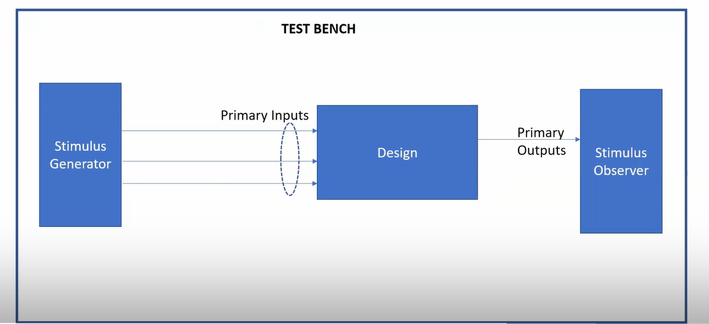
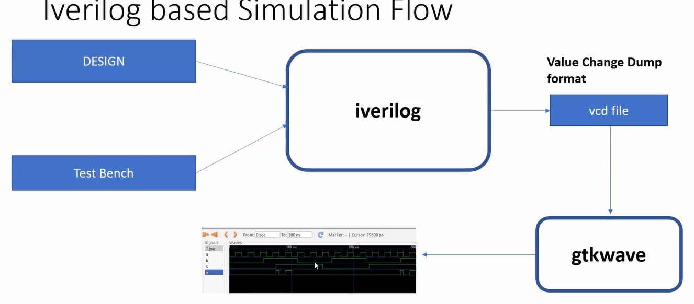
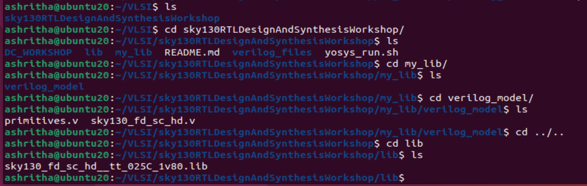
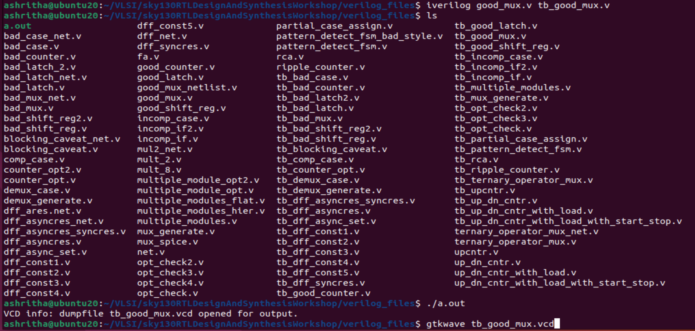
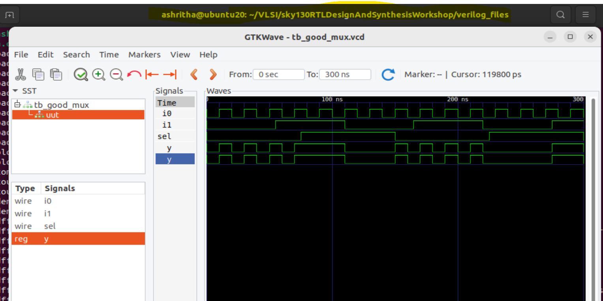
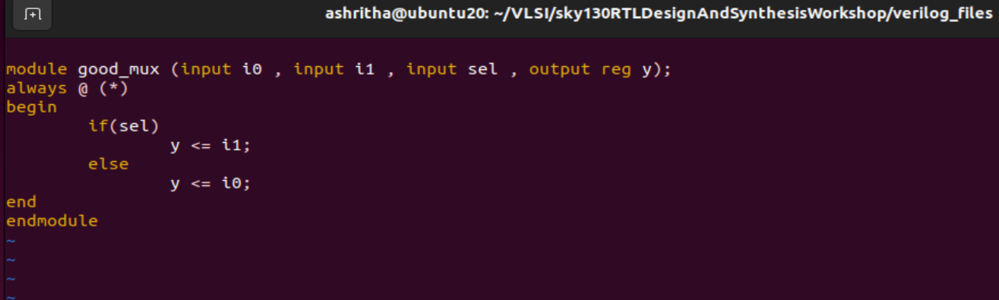
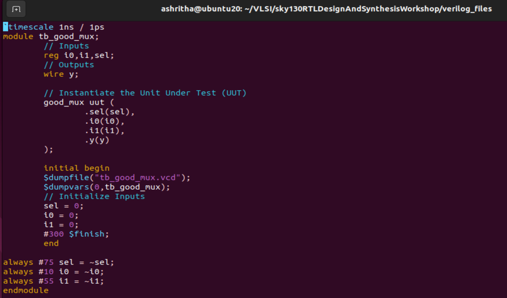
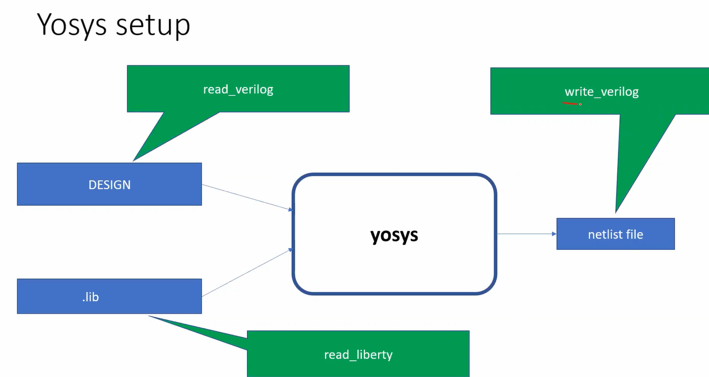
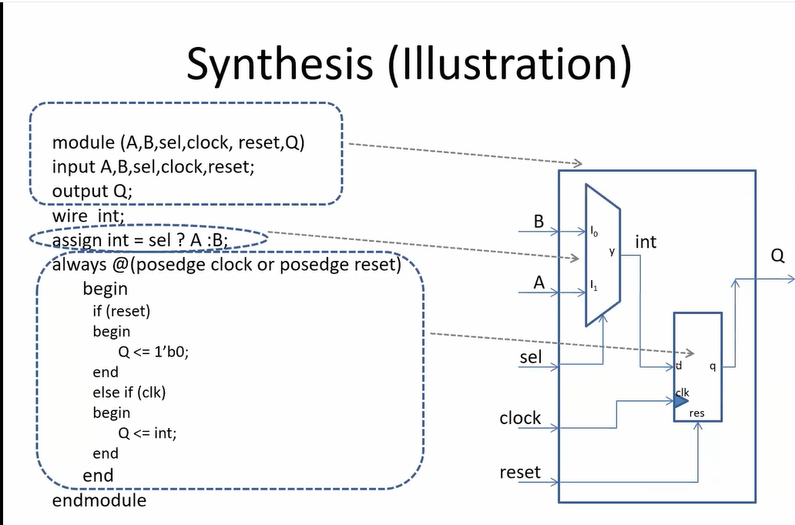

# **WEEK 1 – DAY 1**

**Topic:** Introduction to Verilog RTL Design And Synthesis

---

## **1. Concepts**

### **Simulator**

* A simulator checks whether the RTL design works according to the given specification.
* It applies input changes and evaluates outputs accordingly.

**Working principle:**

* If an input signal changes, the simulator re-evaluates the output.
* If no input changes, the output remains unchanged.
* Hence, simulation is event-driven.

---

### **Design**

* The design is the actual Verilog code (or set of codes).
* It implements the intended functionality to meet specifications.

---

### **Testbench (TB)**

* A testbench is not a real hardware design but a verification environment.
* It generates stimulus (test vectors) and applies them to the DUT (Design Under Test).
* Unlike the design:

  * Design has primary inputs/outputs.
  * Testbench does not have primary inputs/outputs; it only drives and checks the DUT.

---

## **2. Tools Used**

* iverilog → Simulator used to compile and simulate Verilog designs.
* gtkwave → Waveform viewer used to analyze simulation outputs.

---

## **3. Lab Setup**

1. Create project folder:
   mkdir ~/VLSI
   cd ~/VLSI

2. Clone the course repository:
   git clone <repository_link>
   (This creates the folder SkyRTLDesignAndSynthesisWorkshop)

3. Folder structure inside the repo:

   * my_lib/lib → Sky130 standard cell library files used for synthesis.
   * my_lib/verilog_model → Verilog models of the standard cells.
   * verilogfiles/ → Contains all Verilog source and testbench files.

---

## **4. Labs**

### **Lab 1 – Introduction**

* Explore the folder structure and understand library + Verilog files.

---

### **Lab 2 – Using iverilog and gtkwave**

Steps:

1. Go to verilogfiles directory:
   cd SkyRTLDesignAndSynthesisWorkshop/verilogfiles

2. Each design file has a corresponding testbench named tb_<designname>.v

3. Compile design and testbench:
   iverilog designfile.v tb_designfile.v
   (This generates an executable file a.out)

4. Run the simulation:
   ./a.out
   (This produces a VCD file)

5. View the waveform:
   gtkwave dump.vcd

   * A waveform window opens.
   * On the left panel, you can see design, uut (unit under test), and signals.
   * Drag and drop signals to the waveform area.
   * The --> arrows represent transitions in the signals.

---

### **Lab 3 – Observing Design and Testbench**

* Open both the design and its corresponding testbench file.
* Observe:

  * The design has primary inputs and outputs.
  * The testbench generates inputs, connects them to the design, and monitors outputs.

---

### Introduction to Yosys and Standard Cells

**Yosys**:
Yosys is a synthesizer tool used in this course to convert RTL (Register Transfer Level) designs into a gate-level netlist.

**What is a `.lib` file?**
A `.lib` file is a collection of logic modules, or “cells,” which includes various types of gates. Each type of gate can have different “flavors,” such as 2-input or 3-input gates, and different speed variants: slow, medium, or fast.

**Why are different flavors of gates needed?**
The speed of a digital circuit depends on the **combinational delay** along its logic paths. The clock period (`Tclk`) must satisfy the timing equation:

[
T_{clk} > T_{prop_delay_A} + T_{comb} + T_{setup_B}
]

Where `Tprop_delay` is the propagation delay of a flip-flop, `Tcomb` is the delay of combinational logic, and `Tsetup_B` is the setup time of the next flip-flop.

The **maximum clock frequency** is given by:

[
F_{clk(max)} = \frac{1}{T_{clk(min)}}
]

To achieve the maximum clock frequency, the delays in the circuit should be minimized. Therefore, **fast cells** are used to reduce propagation delay.

**Why do we also need slow cells?**
Hold time constraints require a minimum delay between launching data from one flip-flop and capturing it in the next. For example, if data is launched from Flip-Flop A at clock edge `t1`, it must be captured by Flip-Flop B at the next rising edge `t2`. Data cannot change immediately after `t1`; it must remain stable for at least the **hold time** (`Thold`) of Flip-Flop B:

[
T_{clk-to-Q(A)} + T_{comb} > T_{hold(B)}
]

To meet this requirement and prevent hold violations, **slow cells** are used to intentionally increase delay where needed.

**Fast vs Slow Cells**
The delay of a digital logic gate is influenced by the load it drives (capacitance). To charge or discharge this capacitance quickly, transistors must source more current, which is achieved by making them **wider**:

* **Wide transistors** → Low delay → Fast cells → Higher area and power consumption
* **Narrow transistors** → Higher delay → Slow cells → Lower area and power consumption

Hence, fast cells improve performance but incur a cost in area and power. A standard cell library (`.lib`) contains a mixture of slow, medium, and fast cells to balance performance, timing, area, and power.

---

